Hi, I’m Sumit Chaurasiya 👋    
I go by **YoYo178** online.

I don’t move forward until I understand what’s happening.

---

I’m a backend-focused software engineer who builds real systems and
learns them the hard way — by reasoning, verifying, and maintaining them
after they break.

I use AI to *think with*, not to skip thinking 🤝  
If something doesn’t make sense, I stop, trace it, cross-check it
(docs, articles, Stack Overflow), and only then ship.

---

### What this looks like in practice 🛠️

- Production-grade backend systems (Express.js, NestJS, security best practices)
- Real-time capabilities (Socket.IO / WebSockets)
- Auth flows I can explain end-to-end (JWT, sessions, OAuth2)
- Boring infrastructure that stays up (Nginx, EC2, S3, CI/CD)

I value clarity, correctness, and maintainability over cleverness.

---

### Proof, not claims 📌

- **Talketeer** — live chat app, real users, real infra
- **Chess API** — full game logic + REST API from scratch
- **Notes App** — media support + files management using Multer
- Open-source contributor & project maintainer

#### Profile statistics:

#### Pinned repository:

#### Latest repository:

 

If it’s on my GitHub, I can explain *why* it exists and *how* it works.

---

> I’m still a student 🎓      
> That just means I’m early — not shallow.

Actively looking for backend or backend-heavy full-stack roles where I can
build, reason, and grow alongside strong engineers.

🔗 Portfolio: https://sumitchaurasiya.me  
📫 Email: contact@sumitchaurasiya.me
